# GCV Controlled Beta Closure Execution Plan

Date: 2026-08-21

Status: In execution; current decision is **NO-GO**

Target release: version decision pending; recommended `v1.1.0-beta.1` because published tags already reach `v1.0.4`

Target platform: Railway (`staging` first, then `production` after explicit approval)

## 1. Objective

Close a controlled GCV beta with an immutable release candidate, green automated gates, verified tenant isolation, recoverable data, validated onboarding journeys, and an operable production release.

This plan replaces schedule assumptions in older closure documents. The detailed runbooks and the go/no-go checklist remain normative references:

- `docs/BETA_GO_NO_GO_CHECKLIST.md`
- `docs/RAILWAY_OPERATIONS_RUNBOOK.md`
- `docs/DOCUMENT_INGESTION_AND_AI_RUNBOOK.md`
- `docs/DOCUMENT_INGESTION_PERMISSION_MATRIX.md`
- `docs/INCIDENT_RESPONSE_RUNBOOK.md`

## 2. Current Baseline

Evidence collected on 2026-08-21:

| Area | Current state | Beta consequence |
| --- | --- | --- |
| Repository | `main` at `74fc40f`, synchronized with `origin/main`, with a substantial uncommitted ingestion/AI worktree | No immutable release candidate exists for the new functionality |
| Local verification | Typecheck, production build, ingestion API workflow, supporting API suites, and ingestion Playwright passed | Implementation is locally viable but not release evidence |
| GitHub Security | Gitleaks and CodeQL passed for `74fc40f` | Security automation is healthy for the previous committed baseline |
| GitHub CI | Failed for `74fc40f` at `npm audit`; API and browser jobs were skipped | P0 release blocker |
| Dependency audit | Three high findings through Prisma CLI -> `@prisma/config` -> `deepmerge-ts` | Must be fixed, upgraded, or formally risk-accepted without weakening the gate silently |
| Staging | Railway deployment `3469c7f5...` is `SUCCESS`; `/health`, `/livez`, `/readyz` return HTTP 200 | Healthy previous version, not evidence for the uncommitted candidate |
| Production | Railway deployment `e013c3be...` is `SUCCESS` | Must remain unchanged until all gates pass and deployment is explicitly authorized |
| Database changes | Two new ingestion/AI migrations are applied locally only | Must be rehearsed against disposable and staging databases |
| Document storage | Local/Compose persistent volume is supported | A dedicated staging volume, backup, restore, and production storage decision remain open |
| AI/OCR/antivirus | Provider interfaces exist; live provider, OCR, and antivirus are not externally validated | AI remains synthetic-data only; real document ingestion requires an approved security posture |
| Production backup | Native Railway production backup is not enabled | P0 blocker for real beta data |
| Production flags | `ENABLE_AI_ASSISTANT=true`, `ENABLE_E2E_TESTING=true`, and `E2E_TEST_SECRET` are present on the previous production build | Immediate containment required before candidate work |
| Production delivery | Railway deployed `main` even though its GitHub CI failed | Automatic production deployment must be stopped before another push |
| Staging posture | `NODE_ENV=production`; document storage, antivirus, and OCR are absent | Environment contract and document posture must be corrected or explicitly documented |
| Version contract | Git tags reach `v1.0.4`, while package/changelog still describe pre-1.0 versions | Version must not regress; align package, changelog, tag, and release notes |

Current decision: **NO-GO** until Gates 0 through 7 are complete.

### Execution checkpoint - 2026-08-21

| Item | State | Evidence |
| --- | --- | --- |
| Production containment | Complete | AI, E2E, GitHub integration and demo exports disabled; E2E secret removed; automatic GitHub source disconnected; health probes return HTTP 200 |
| Staging containment | Complete | Automatic GitHub source disconnected; persistent document volume mounted; document/AI features disabled; health probes return HTTP 200 |
| Production logical checkpoint | Complete locally | PostgreSQL 18 custom dump stored outside the Windows worktree with mode `0600` and SHA-256 recorded in the operator evidence |
| OAuth callback hardening | Implemented, validation pending | Trusted `APP_URL`, nonce CSP, safe serialization, verified Google e-mail requirement and Microsoft beta shutdown |
| Password recovery | Implemented, validation pending | Hashed, expiring, one-use tokens; anti-enumeration; session-version revocation; audit trail |
| Google client-secret rotation | External action pending | Credential was exposed previously and must be rotated in Google Cloud before GO |
| GitHub branch protection | External action pending | Current GitHub identity lacks repository administration permission |
| Candidate CI and staging rehearsal | Pending | Candidate has not yet been committed or deployed |
| Production release | Pending | Explicit GO remains required after Gates 1-7 |

### Immediate security findings

- The deployed production AI path predates the tenant-filtered RAG implementation and can receive arbitrary frontend context. Keep AI disabled until the new path is reviewed and deployed.
- A Google OAuth client secret was previously exposed in an editor/chat capture. Treat it as compromised, rotate it, and use distinct secrets per environment.
- OAuth callback pages interpolate user/error values into HTML while Content Security Policy is disabled. Escape and serialize output safely, derive redirects from `APP_URL`, and enable an appropriate CSP.
- Microsoft OAuth treats the returned email as verified. Because Microsoft is outside beta scope, disable the provider routes and credentials rather than leaving a partial login path.
- RAG currently filters account/condominium but not all document role, current-version, clean-scan, and indexed-status constraints.
- The document pipeline indexes content when antivirus is unavailable. Real uploads require quarantine and fail-closed scanning.
- Soft deletion does not yet physically purge binaries, versions, chunks, proposals, or backups under a retention policy.

## 3. Controlled Beta Scope

### Included

- Platform administrator login and condominium/syndic onboarding.
- Syndic setup of building, units, residents, and invitations.
- Resident invitation acceptance and access limited to authorized units.
- Tenant-scoped operational dashboard, equipment, preventive plans, service orders, logs, and notices. Financial views are included only when read-only or explicitly labeled as non-transactional beta data.
- Document upload, catalog, metadata correction, versioning, signed download, and traceability, subject to the security/storage gate.
- AI-assisted document consultation and draft generation only for approved beta tenants and under the AI gate.
- Auditing of authentication, authorization, invitations, document operations, and AI proposal review.

### Restricted beta-lab capabilities

- AI starts disabled. It may be enabled in staging with synthetic data after Gate 5 begins and the safe RAG candidate is deployed.
- Real tenant documents may reach AI only after privacy/LGPD approval, provider terms review, tenant permission tests, retention definition, and explicit tenant consent.
- Every maintenance plan or service order generated by AI remains a draft until human approval.

### Recommended release profiles

**Profile A - Operational beta:** recommended first release. One pilot condominium, one syndic, five to ten residents, the two platform administrators, and synthetic operational data during rehearsal. Document ingestion and AI are hidden or disabled until their security gates pass.

**Profile B - Document and AI beta:** includes Profile A plus real document upload and AI. It requires persistent storage, antivirus fail-closed, complete document/RAG ACL, retention/purge, provider privacy approval, quotas, and paired database/file restore.

Profile A may receive `GO` without Profile B only when document and AI entry points are unavailable to beta users, not merely expected to remain unused.

### Not part of beta acceptance

- Microsoft OAuth, until real credentials and callbacks are intentionally restored to scope.
- Formal accounting ledger, bank reconciliation, CNAB, real boleto, or real Pix settlement. Simulated barcode/Pix actions must be hidden or explicitly labeled as demonstration and unavailable to residents.
- Production-grade BIM authoring, DWG/IFC processing, autonomous engineering decisions, or regulatory certification.
- Automatic activation of AI proposals.
- Unrestricted customer onboarding or public self-registration.

## 4. Roles And Decision Owners

| Responsibility | Owner | Approval required |
| --- | --- | --- |
| Code, migrations, tests, release notes | Engineering/Codex | Technical reviewer |
| Railway services, volumes, secrets, backups | Platform owner | Account owner |
| OAuth configuration and manual login | Identity owner | Platform owner |
| Privacy, retention, AI real-data posture | LGPD/security owner | Product owner |
| Building-management workflow acceptance | Product owner and beta syndic | Product owner |
| Production go/no-go | Product owner | Security and engineering concurrence |
| Rollback decision | Incident commander | Product owner informed |

No single successful deployment constitutes beta approval. The signed checklist is the approval record.

## 5. Critical Path

```mermaid
flowchart LR
    G0["G0 Immediate production containment"] --> G1["G1 Scope and worktree freeze"]
    G1 --> G2["G2 Release candidate and dependencies"]
    G2 --> G3["G3 Local and CI quality gates"]
    G3 --> G4["G4 Staging infrastructure and data safety"]
    G4 --> G5["G5 Immutable staging rehearsal"]
    G5 --> G6["G6 UAT and security acceptance"]
    G6 --> G7["G7 Production readiness review"]
    G7 --> G8["G8 Controlled production release"]
    G8 --> G9["G9 Seven-day stabilization"]
```



Target duration after execution authorization: 8-12 working days, excluding delays for external provider approval or backup-plan changes.

## 6. Gates And Work Packages

### Gate 0 - Immediate Production Containment

**Goal:** prevent another unapproved production change and disable exposed test/AI surfaces on the previous build.

**External actions in Railway:**

- Disable automatic production deployment from every `main` push; require manual promotion of an accepted immutable SHA/tag.
- Set production `ENABLE_AI_ASSISTANT=false` until the safe RAG candidate passes Gate 6.
- Set production `ENABLE_E2E_TESTING=false` and remove `E2E_TEST_SECRET`.
- Keep `ENABLE_GITHUB_INTEGRATION=false` and `ENABLE_DEMO_EXPORTS=false`.
- Rotate the exposed Google OAuth client secret, use an environment-specific credential, and update only the secret store.
- Confirm production remains healthy after the variable redeploy.

**Acceptance evidence:**

- Sanitized variable audit records booleans/presence only, never secret values.
- Production deployment policy no longer follows an unapproved `main` push.
- `/health`, `/livez`, and `/readyz` return HTTP 200.
- AI and testing endpoints return their controlled disabled/not-found responses.

**Rollback:** only configuration changes are involved. If a variable redeploy fails, restore the previous non-secret feature posture while keeping AI/E2E disabled and redeploy the last healthy application image.

### Gate 1 - Scope And Worktree Freeze

**Goal:** create one reviewable candidate without losing or mixing unrelated local work.

**Work:**

- Inventory every modified/untracked file and distinguish ingestion/AI changes from pre-existing onboarding changes.
- Review the final diff for secrets, downloaded OAuth JSON, generated files, test artifacts, and tenant data.
- Confirm the beta scope and explicitly record Microsoft OAuth, AI real-data use, OCR, antivirus, and document retention decisions.
- Select Profile A or Profile B. Profile A is the recommended first release.
- Hide or explicitly disable excluded modules and simulated financial actions; no control may appear production-capable and then fail only after user action.
- Define whether password login remains in beta. If it does, implement secure password reset/recovery before release.
- Align the release version with existing `v1.0.x` tags, `package.json`, changelog, and Railway release notes.
- Update the go/no-go checklist so exclusions are explicit rather than permanently unchecked requirements.
- Define the beta users, beta condominium, data classification, support contact, and incident owner.

**Acceptance evidence:**

- Scope signed by product owner.
- No secrets or real tenant content in `git diff` or untracked files.
- Worktree inventory reviewed.
- No application or database production deployment performed during candidate assembly.

**Rollback:** no runtime change; preserve a patch and return to the last committed baseline if candidate assembly fails.

### Gate 2 - Release Candidate And Dependency Closure

**Goal:** produce an immutable candidate that can pass CI.

**Work:**

- Resolve the Prisma CLI/deepmerge high advisory through a tested compatible upgrade or a documented, time-bounded exception approved by security.
- Do not run `npm audit fix --force` without reviewing Prisma compatibility and migration behavior.
- Align CI environment variables with ingestion tests, including a temporary document-storage directory and synthetic AI mode where required.
- Split feature-disabled API tests from ingestion/AI mock tests: the former require AI disabled, while ingestion requires `ENABLE_E2E_TESTING=true` and a test-only provider.
- Replace the current production E2E command with a non-destructive production smoke suite that never depends on `/api/v1/testing/*`, `E2E_TEST_SECRET`, or production write cleanup.
- Add `test:role-flow` to CI so real onboarding service behavior is not covered only by mocked browser calls.
- Correct OAuth callback output escaping/CSP/redirect handling and disable Microsoft login for the beta contract.
- Fix equipment creation so unknown inspection/install dates remain unknown rather than becoming the current date.
- Align resident service-order display with the backend `resolved` status and add missing transition/audit coverage for equipment, plans, and service orders.
- Update the incident runbook to the Railway architecture, current contacts, current variables, and the applicable ANPD notification workflow.
- Ensure CI cleans storage artifacts and test database records even on failure.
- Update `CHANGELOG.md` with onboarding, permissions, document ingestion, RAG, AI drafts, migrations, security controls, and known limitations.
- After explicit authorization, create a bounded release branch/PR and commits grouped by domain.

**Required commands:**

```bash
npm ci
npm run audit
npm run lint
npm run build
git diff --check
```

**Acceptance evidence:**

- `npm run audit` exits zero, or an approved exception identifies advisory, exposure, compensating controls, owner, and expiry.
- Lockfile is reproducible with `npm ci`.
- Candidate commit SHA is recorded and no longer changes during validation.

**Rollback:** revert dependency-only commit or abandon the release branch; do not rewrite production history.

### Gate 3 - Local And GitHub Quality Gates

**Goal:** prove the complete candidate on a clean database and browser runtime.

**Work:**

- Recreate a disposable PostgreSQL database and apply only committed migrations.
- Seed synthetic data and run all unit/harness, API, role-flow, ingestion, and Playwright suites.
- Exercise upload success, invalid MIME, oversize, duplicate, interrupted transfer, retry, versioning, signed download, soft delete, and cleanup.
- Exercise system admin -> syndic -> resident onboarding and negative authorization paths.
- Confirm cross-condominium requests cannot list, query, download, mutate, or use AI over foreign data.
- Exercise RAG against role-restricted documents, old versions, non-clean scans, partial/failed processing, and deleted documents.
- Exercise OAuth callback escaping, fixed redirect origins, disabled Microsoft flow, and password recovery if retained.
- Run GitHub CI and Security workflows on the exact candidate SHA.

**Required commands:**

```bash
npm run db:migrate:verify
npm test
npm run test:role-flow
npm run test:api
npm run test:e2e -- --project=chromium
gh run list --branch <release-branch>
```

**Acceptance evidence:**

- Quality Gate, API Smoke, Browser E2E, Gitleaks, and CodeQL are green on the same SHA.
- Playwright report and API logs are retained as artifacts.
- Test cleanup reports zero remaining `TEST_E2E_` records and files.
- No high/critical auth, tenant, secret, document, or migration finding remains unowned.

**Rollback:** fix forward on the release branch and restart the gate from the new immutable SHA.

### Gate 4 - Staging Infrastructure And Data Safety

**Goal:** prepare an isolated rehearsal environment that reflects production controls.

**External actions:**

- For Profile B, attach a dedicated Railway staging volume and set `DOCUMENT_STORAGE_PATH` to its mount path. For Profile A, keep document entry points disabled.
- Confirm staging has its own database, storage, domain, session secret, OAuth secret, and approved allowlist.
- Configure PostgreSQL backup for both profiles. For Profile B, also back up document storage; otherwise keep document ingestion disabled until metadata and binaries can be restored consistently.
- Target `RPO <= 24h` and `RTO <= 8h`; combine provider snapshots/PITR when available with an encrypted external logical copy.
- For Profile B, configure an antivirus endpoint for real document tests. Without it, use only synthetic/trusted fixtures and keep real uploads blocked.
- Require quarantine and fail-closed scanning before extraction/indexing; test compressed-document expansion limits and per-user/per-tenant quotas.
- Configure OCR only if image/scanned-PDF acceptance is required for beta.
- Configure Gemini or Vertex AI only for synthetic staging validation; apply quota and billing alerts.

**Configuration posture:**

```text
NODE_ENV=staging
APP_URL=https://gcv-app-staging-staging.up.railway.app
ENABLE_E2E_TESTING=true only during the controlled test window
ENABLE_AI_ASSISTANT=false by default
ENABLE_GITHUB_INTEGRATION=false
ENABLE_DEMO_EXPORTS=false
```

**Acceptance evidence:**

- Required variable names are present; secret values are never copied into documentation or logs.
- Database and volume are environment-isolated.
- A backup and restore drill recovers matching document metadata and binaries.
- Restored application returns HTTP 200 on `/readyz`.
- RPO/RTO, operator, source, timestamps, row counts, file counts, and result are recorded.

**Rollback:** disable document/AI flags, detach the candidate service from beta access, and restore staging from the verified checkpoint.

### Gate 5 - Immutable Staging Rehearsal

**Goal:** deploy the exact candidate to staging and validate it end to end.

**Work:**

- Take the pre-migration staging backup.
- Deploy the candidate SHA only after explicit authorization.
- Run `npm run db:migrate:deploy` as pre-deploy and `npm run start` as start command.
- Verify migration logs, startup recovery for queued documents, health endpoints, and no migration drift.
- Run API smoke and Playwright against staging with disposable `TEST_E2E_` data.
- Manually validate Google OAuth for both platform administrators and at least one invited syndic/resident journey.
- Test upload/process/query/draft/review with a synthetic technical document.
- Confirm staging has all 19 committed migrations before accepting the candidate.
- Disable `ENABLE_E2E_TESTING` after the controlled suite.

**Acceptance evidence:**

```bash
curl -fsS "$STAGING_URL/health"
curl -fsS "$STAGING_URL/livez"
curl -fsS "$STAGING_URL/readyz"
PLAYWRIGHT_BASE_URL="$STAGING_URL" npm run test:e2e -- --project=chromium
```

- Railway deployment is `SUCCESS` for the recorded candidate SHA.
- Migrations ran exactly once and can be reapplied idempotently.
- No residual test records/files remain.
- Application logs contain no secret, document body, or unnecessary PII.

**Rollback:** redeploy the last healthy staging SHA; use forward-fix migrations by default, and restore database plus document volume together if integrity was affected.

### Gate 6 - UAT, Security, And Privacy Acceptance

**Goal:** confirm that the beta solves the intended building-management journeys safely.

**UAT journeys:**

1. A platform administrator creates a condominium and invites its syndic.
2. The syndic accepts access, reviews the building, creates a block/unit, and invites a resident.
3. The resident accepts once, sees only the authorized condominium/unit, and cannot administer users or other tenants.
4. The syndic creates equipment, a preventive plan, a service order, and validates dashboard indicators.
5. A resident opens a repair request; the syndic assigns, comments, and resolves it; the resident view and dashboard update consistently.
6. A syndic publishes an announcement and the resident sees it.
7. Authorized staff uploads and versions a document; an unauthorized role is blocked. This journey applies only to Profile B.
8. The assistant cites an allowed synthetic document and creates a visible draft, which is rejected or approved by a human. This journey applies only to Profile B.
9. Invitation resend, cancellation, expiry, revocation, logout, session restoration, and password recovery when retained behave as specified.

**Security/privacy checks:**

- Tenant isolation is manually spot-checked with two synthetic condominiums.
- Prompt-injection fixtures do not override system policy or expose foreign content.
- Signed download URLs expire and cannot be reused by another identity.
- RAG retrieves only the current, indexed, clean, role-authorized version and never returns a foreign-tenant chunk.
- Retention, deletion, incident contact, privacy notice, consent/legal basis, and data-subject request path are approved.
- A retention table covers category, purpose, legal basis, duration, legal hold, physical purge, backups, and responsible owner; purge is tested for binary, versions, chunks, and proposals.
- `system_admin` global access is accepted as a governed privileged role with nominative accounts and provider MFA.
- Any AI real-data use has documented provider region, retention/training terms, purpose, minimization, and human-review controls.

**Acceptance evidence:**

- UAT sheet records tester, timestamp, tenant, steps, result, screenshot, and issue link.
- Zero open severity-1/severity-2 defects.
- Lower-severity accepted defects have owner and target date.
- Product, engineering, and security/LGPD owners sign the gate.

**Rollback:** keep production unchanged and return failed journeys to engineering.

### Gate 7 - Production Readiness And Go/No-Go

**Goal:** make release, recovery, observability, and support decisions before changing production.

**Work:**

- Enable scheduled production PostgreSQL backups or implement encrypted external logical backups with tested access controls.
- Define backup for the production document store; database and binary restore points must be consistent.
- Perform a final recovery rehearsal and confirm restored `/readyz`.
- Verify unique strong `SESSION_SECRET`, production Google OAuth credentials/callback, minimal allowlist, feature flags, storage path, quotas, and alert contacts.
- Disable `ENABLE_E2E_TESTING`, mock routes, AI, GitHub, and demo exports unless each has explicit approval.
- Confirm deployment uses an immutable SHA/tag and production is not automatically deployed from every `main` push.
- Confirm branch protection/ruleset prevents an unreviewed red-CI candidate from becoming a production release.
- Record last healthy deployment, rollback operator, maintenance window, smoke owner, and communication template.
- Complete `docs/BETA_GO_NO_GO_CHECKLIST.md`.

**GO requires all of the following:**

- Exact candidate is green in CI and staging.
- Database backup and restore are proven; Profile B also proves document metadata/binary restore at the same logical point.
- Google OAuth and all three critical personas pass.
- Tenant isolation and authorization negative tests pass.
- Zero unaccepted high/critical security or dependency findings.
- Production variables and flags are reviewed by two people without exposing values.
- Rollback and incident procedures have named operators.
- Product owner records `GO`, date, candidate SHA, tag, approved beta users, and limitations.

**Automatic NO-GO triggers:**

- Red or skipped required CI job.
- Unverified migration, backup, restore, tenant isolation, or OAuth.
- Missing document binary backup while real document upload is enabled.
- Unapproved AI processing of personal/tenant data.
- Open severity-1/severity-2 defect.
- Different SHA between staging acceptance and production candidate.

### Gate 8 - Controlled Production Release

**Goal:** release to the allowlisted beta cohort with immediate rollback capability.

**Sequence:**

1. Freeze changes and create the signed pre-migration backup.
2. Create the approved signed/annotated beta tag from the accepted SHA; recommended `v1.1.0-beta.1`.
3. Deploy only after the user's explicit command and manual production approval.
4. Observe migration and startup logs; require `/readyz` before routing beta users.
5. Run non-destructive anonymous health checks and one controlled authenticated smoke journey.
6. Verify Google login, tenant selection, dashboard, invitation acceptance, and one core operational write.
7. Confirm no `TEST_E2E_` residue and no unexpected queue backlog.
8. Publish release notes and beta limitations.

**Rollback thresholds:** any cross-tenant exposure, authentication outage, migration corruption, unrecoverable document mismatch, repeated 5xx, or failed readiness after the agreed retry window.

**Rollback:** disable traffic/feature flags where sufficient; otherwise redeploy the last healthy image. Restore data only through the recovery-first procedure, never by ad hoc destructive SQL.

### Gate 9 - Seven-Day Stabilization

**Goal:** determine whether to maintain, expand, or pause the beta.

**Daily review:**

- Availability and `/readyz` failures.
- Login/OAuth success and invitation conversion.
- 4xx/5xx rate and top failing routes.
- Queue age, failed/partial document processing, storage consumption, and orphaned metadata/files.
- AI requests, provider failures, token/cost consumption, citation coverage, and proposal approval/rejection.
- Security alerts, cross-tenant denials, privileged actions, and deletion requests.
- User-reported blockers by journey and condominium.
- Availability target `>= 99.5%`, API 5xx `< 1%`, and read p95 target `< 500 ms`, subject to measurement availability.
- Invitation activation target: 100% of pilot syndics and at least 80% of invited pilot residents.
- Support targets: P0 acknowledgement in 15 minutes; P1 in one hour, with a workaround target of four hours.

**Exit criteria after seven days:**

- No severity-1 incident or confirmed tenant/data exposure.
- No unresolved severity-2 defect in onboarding or core operations.
- Backup job and restore evidence remain current.
- At least one complete admin -> syndic -> resident journey succeeds in production.
- Product owner decides `continue`, `expand`, or `pause` and records rationale.

## 7. Synthetic UAT Dataset

Use reproducible synthetic fixtures; never use real resident, financial, OAuth, or technical documents during automated rehearsal.

| Tenant | Purpose | Minimum content |
| --- | --- | --- |
| `TEST_UAT_HORIZONTE` | Main positive journey | 2 blocks, 8 units, 6 residents, 6 equipment items, 5 plans, 6 service orders, 3 announcements |
| `TEST_UAT_AURORA` | Cross-tenant negative tests | 2 units, 1 resident, 1 equipment item, and unique content never visible to Horizonte |
| `TEST_UAT_VAZIO` | Empty-state validation | No operational records after onboarding |

Invitation fixtures cover `sent`, `accepted`, `expired`, `cancelled`, and `revoked`. Profile B document fixtures include a pump manual, elevator inspection report, contract, asset spreadsheet, checksum duplicate, oversized/invalid file, and prompt-injection sample.

Each UAT record must capture candidate SHA, tester, timestamp, tenant, result, request ID when available, screenshot/evidence link, and defect reference.

## 8. Execution Board

| ID | Package | Priority | Owner | Depends on | Status |
| --- | --- | --- | --- | --- | --- |
| BETA-00 | Contain production auto-deploy, AI/E2E, and exposed OAuth secret | P0 | Platform owner | None | Contained; Google secret rotation pending |
| BETA-01 | Approve Profile A/B, exclusions, cohort, data posture, and version | P0 | Product | BETA-00 | Profile A/version selected; owner sign-off pending |
| BETA-02 | Inventory and freeze current worktree | P0 | Engineering | BETA-01 | Complete |
| BETA-03 | Fix OAuth callback, Microsoft posture, core workflow semantics, and recovery decision | P0 | Engineering | BETA-02 | Complete locally |
| BETA-04 | Resolve/accept Prisma audit advisory | P0 | Engineering + Security | BETA-02 | Complete: zero audit findings |
| BETA-05 | Split/fix complete CI and safe production smoke | P0 | Engineering | BETA-03/04 | Complete locally; GitHub evidence pending |
| BETA-06 | Review 19 migrations on clean/disposable PostgreSQL | P0 | Engineering | BETA-05 | Complete locally without drift |
| BETA-07 | Provision isolated staging document volume for Profile B | P0 | Platform owner | BETA-01 | Complete; unused while Profile A flags remain off |
| BETA-08 | Fix RAG ACL, quarantine/AV, retention/purge for Profile B | P0 | Engineering + Security | BETA-02 | Code complete; external AV/approval pending for Profile B |
| BETA-09 | Prove database backup/restore, plus documents for Profile B | P0 | Platform owner | BETA-06, plus BETA-07/08 for Profile B | Local checkpoint complete; scheduled external backup pending |
| BETA-10 | Publish immutable candidate to staging | P0 | Release owner | BETA-05/06 and profile gates | Requires authorization |
| BETA-11 | Run staging API/E2E/tenant isolation suite | P0 | QA | BETA-10 | Pending |
| BETA-12 | Validate Google OAuth and three-persona UAT | P0 | Product + QA | BETA-10 | External/manual |
| BETA-13 | Approve LGPD, retention, incident, and AI posture | P0 | Security/LGPD | BETA-09/11 | Pending |
| BETA-14 | Configure branch protection and manual production promotion | P0 | Platform owner | BETA-05 | External |
| BETA-15 | Sign go/no-go and rollback readiness | P0 | Product owner | BETA-09/11/12/13/14 | Pending |
| BETA-16 | Tag and deploy controlled production beta | P0 | Release owner | BETA-15 | Requires authorization |
| BETA-17 | Execute seven-day stabilization | P1 | Product + Operations | BETA-16 | Pending |

## 9. External Actions Reserved For The User

Codex can prepare code, migrations, tests, documentation, commands, CI fixes, and evidence. The following require account-owner or manual action:

- Approve scope, accepted risks, and the beta cohort.
- Create/attach Railway volumes or change subscription/backup capabilities.
- Enter or rotate secrets in Railway, Google Cloud, Gemini, Vertex AI, OCR, or antivirus consoles.
- Validate interactive Google OAuth identities.
- Approve provider billing, quotas, data terms, and LGPD posture.
- Approve commit/push/PR, staging deployment, production tag, and production deployment when requested.
- Sign the final go/no-go decision.

## 10. Time-Bounded Risk Acceptance

The controlled beta may accept the following limitations only with an owner, rationale, mitigation, expiry date, and re-evaluation trigger:

- Railway Volume instead of object storage, with quota, encrypted external copy, and proven restore.
- In-memory processing queue at low volume, with startup recovery, failed-job visibility, and manual retry.
- Lexical retrieval without embeddings, provided ACL, current-version, clean-scan, and tenant constraints pass.
- One-person human approval for AI drafts, while plans remain `suspended` and orders remain `reported` until approved.
- Manual LGPD request handling, with a named owner, documented intake, identity verification, deadlines, and evidence.
- Global access for the two nominative `system_admin` users, with Google MFA, audit, alerts, and periodic review.

The following cannot be accepted as beta risk: cross-tenant exposure, unverified backup/restore, exposed active secrets, red mandatory CI, unreviewed destructive migration, real-document indexing without the selected security posture, or autonomous AI activation.

## 11. Definition Of Beta Closed

The beta is closed only when:

1. `docs/BETA_GO_NO_GO_CHECKLIST.md` has no unresolved required item.
2. The accepted SHA is identical across CI evidence, staging UAT, tag, and production.
3. Production is healthy, recoverable, allowlisted, monitored, and supported.
4. The three critical personas complete their journeys with tenant isolation intact.
5. Real documents and AI are either fully approved under the stated controls or remain disabled.
6. Release notes, limitations, incident owner, rollback point, and seven-day review schedule are recorded.

Until then, the environment may be used for synthetic validation but must not be described as ready for unrestricted real-data beta use.
