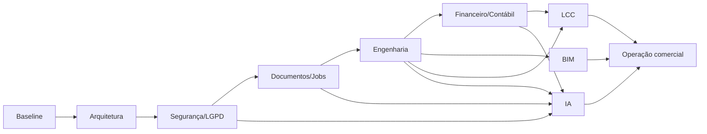

# Plano CodexGPT para implementação do produto completo

Data: 2026-07-11

Status: fila canônica de implementação pós-beta

Arquitetura de referência: `docs/TARGET_PRODUCT_ARCHITECTURE.md`

Objetivo: evoluir o GCV do beta operacional para um produto auditável de gestão condominial, engenharia predial, BIM, LCC, IA e contabilidade gerencial.

## 1. Regras de execução

1. Executar os gates em ordem; tarefas paralelas só podem alterar contextos independentes.
2. Uma tarefa Codex por branch e PR, salvo correções inseparáveis.
3. Nunca usar dados reais em testes, fixtures ou prompts.
4. Não habilitar uma capacidade em produção antes de seus critérios de saída.
5. Toda alteração de schema inclui migration, seed sintético e testes.
6. Toda API mutável inclui validação, autorização, auditoria e teste negativo cross-tenant.
7. Todo cálculo financeiro ou LCC inclui testes determinísticos.
8. Toda integração inclui idempotência, timeout, retry controlado e reconciliação.
9. IA não substitui cálculo, aprovação, laudo ou lançamento oficial.
10. Antes de iniciar uma tarefa, reler o estado do repositório; planos antigos podem conter baseline obsoleto.

Formato obrigatório de tarefa:

```text
Title:
Gate:
Goal:
Specialist Review Required:
Context Files:
Dependencies:
Non-goals:
Expected Changes:
Data/Migration Impact:
Security/LGPD Impact:
Acceptance Criteria:
Verification Commands:
Risk/Rollback Notes:
Documentation Updates:
```

## 2. Estratégia de branches e qualidade

- `main`: integração e dev; protegida por PR.
- release candidate: tag de staging usando o mesmo digest.
- produção: tag SemVer aprovada.
- commits organizados por contexto, sem misturar refatoração ampla e regra de negócio.

Gate mínimo de cada PR:

```bash
npm ci
npm run lint
npm run build
npm test
npm run test:api
npm audit --audit-level=high
```

Quando aplicável: migration clean-room, Playwright, testes de contrato, acessibilidade, carga, restore e avaliação de IA.

## 3. Gate 0 — Baseline confiável e release

Objetivo: consolidar o estado atual antes da expansão funcional.

### G0.1 Publicar e promover o commit pendente

- revisar `515d036`;
- enviar para GitHub por PR ou push aprovado;
- confirmar CI;
- promover o mesmo código em dev, staging e production;
- repetir healthchecks e E2E de produção.

Aceite: ambientes executam o mesmo commit/digest e não há alteração local não rastreada.

### G0.2 Atualizar documentação de estado

- reconciliar README, status de fechamento e checklist com a infraestrutura real;
- marcar documentos históricos como tal;
- registrar esta arquitetura como fonte pós-beta.

Aceite: nenhum documento ativo afirma que dados ainda vivem somente em `localStorage`.

### G0.3 Tornar E2E gate de CI

- executar Playwright contra app efêmero e banco descartável;
- manter suíte de produção como pós-deploy controlado;
- publicar screenshots, trace e relatório;
- bloquear merge por falha em jornada crítica.

Aceite: login, tenant switch, manutenção, cobrança, documentos e permissões são testados em CI.

### G0.4 Backup, restore e rollback

- habilitar e verificar backup de produção;
- executar restore em staging/recovery;
- registrar RPO/RTO e contagens reconciliadas;
- testar rollback de aplicação compatível com schema.

Aceite: checklist go/no-go possui evidência e responsável.

Critério de saída do Gate 0: CI verde, E2E no gate, restore comprovado e releases reproduzíveis.

## 4. Gate 1 — Modularização e contratos

Objetivo: reduzir o risco estrutural antes de ampliar domínios.

### G1.1 ADR do monólito modular

- criar ADR-007;
- definir módulos backend e frontend conforme contextos da arquitetura;
- proibir importações que atravessem fronteiras sem contrato.

### G1.2 Cliente API tipado

- centralizar fetch, erros, sessão, `requestId` e CSRF;
- compartilhar schemas Zod ou gerar cliente pelo OpenAPI;
- remover `any` dos contratos prioritários.

### G1.3 Decompor `App.tsx`

- introduzir router URL;
- extrair shell, sessão, tenant e navegação;
- criar hooks/query cache por domínio;
- remover duplicação de mapeamento API/UI.

### G1.4 Contratos e erros

- gerar OpenAPI;
- padronizar Problem Details;
- implementar paginação e filtros;
- adicionar optimistic locking nos primeiros CRUDs.

### G1.5 Design system e acessibilidade

- componentes de modal, formulário, tabela, estado vazio e feedback;
- foco, teclado, contraste e leitores de tela;
- testes axe nos fluxos críticos.

Critério de saída: nenhum estado de negócio depende de `localStorage`; shell e três domínios usam cliente tipado; WCAG crítica sem violações bloqueantes.

## 5. Gate 2 — Segurança, auditoria e LGPD

### G2.1 Matriz RBAC/ABAC

- formalizar ações por papel e recurso;
- escopo por conta, condomínio, unidade e classificação;
- separação entre solicitante, aprovador e pagador.

### G2.2 Auditoria imutável

- antes/depois estruturado, motivo, request ID e correlação;
- distinguir log operacional de trilha de auditoria;
- impedir alteração ou exclusão pela aplicação comum.

### G2.3 Privacidade

- inventário de dados e base legal;
- retenção e descarte;
- exportação/correção do titular;
- mascaramento de logs e ambientes não produtivos.

### G2.4 Sessões privilegiadas

- MFA pelo IdP quando disponível;
- revogação e timeout por risco;
- rotação de segredos e revisão de contas.

Critério de saída: testes negativos cobrem todas as APIs; nenhuma PII proibida aparece em logs; política LGPD aprovada externamente.

## 6. Gate 3 — Documentos e importações produtivas

### G3.1 Object storage

- criar ADR-008;
- upload direto com URL assinada;
- hash, MIME, tamanho, versão e estado de processamento;
- antivírus e quarentena.

### G3.2 Taxonomia e retenção

- categorias técnicas, legais, financeiras, administrativas e de unidade;
- validade e alertas;
- ACL e histórico de acesso.

### G3.3 Importação governada

- mapeamento de colunas e templates versionados;
- checksum e preservação do arquivo original;
- preview, reconciliação e aprovação por segunda pessoa;
- reversão ou compensação por lote.

### G3.4 Worker e fila

- outbox transacional;
- jobs idempotentes, retries e dead-letter;
- dashboard de estado e reprocessamento.

Critério de saída: arquivos sobrevivem a redeploy; conteúdo adulterado é detectado; importação repetida não duplica dados.

## 7. Gate 4 — Engenharia predial e manutenção

Revisão obrigatória: engenheiro civil/mecânico/elétrico conforme o subsistema e administrador predial.

### G4.1 Hierarquia física e ativos

- criar Floor, Space, Asset e AssetComponent;
- código patrimonial, fabricante, série, garantia e vida útil;
- migrar `Equipment` preservando IDs e histórico.

### G4.2 Inspeções e evidências

- checklist versionado, medição, condição e não conformidade;
- anexos, assinatura/autor e timestamp;
- ação corretiva ligada à OS.

### G4.3 Compliance técnico

- requisitos configuráveis por jurisdição e tipo de ativo;
- certificados, vencimentos, ART/RRT e responsável técnico;
- alertas e painel de risco com fonte da regra.

### G4.4 Ordens de serviço completas

- SLA, equipe/fornecedor, materiais, horas, custos e aprovação;
- estados formais e transições válidas;
- geração automática a partir do plano;
- vínculo com compra, documento e pagamento.

### G4.5 Contratos e fornecedores

- cadastro, documentos, vigência, reajuste, SLA e escopo;
- cotações comparáveis e aprovação;
- avaliação de desempenho.

Critério de saída: um ativo pode ser rastreado do cadastro ao plano, inspeção, falha, OS, evidência, custo e obrigação técnica.

## 8. Gate 5 — Financeiro e contabilidade gerencial

Revisão obrigatória: contador e responsável financeiro. Não declarar conformidade fiscal apenas com testes de software.

### G5.1 Dinheiro em Decimal

- migrar Charge, line items e custos de manutenção;
- definir moeda e política de arredondamento;
- reconciliar valores antes/depois.

### G5.2 Plano de contas e centros de custo

- criar ADR-009;
- modelo versionado por administradora/condomínio;
- centros por edifício, área, contrato e projeto.

### G5.3 Ledger de partidas dobradas

- JournalEntry e JournalLine imutáveis;
- regras versionadas de evento para lançamento;
- estorno em vez de edição destrutiva;
- teste invariável débito = crédito.

### G5.4 Contas a receber

- competência, emissão, vencimento, multa, juros e descontos;
- recebimento parcial e baixa;
- separar cobrança interna de título externo.

### G5.5 Contas a pagar

- documento fiscal, aprovação, agendamento, retenções informativas e baixa;
- vínculo com fornecedor, contrato, compra e OS;
- segregação de funções.

### G5.6 Banco e reconciliação

- importar OFX/CNAB/extrato por adaptador;
- PSP/boleto/Pix somente após ADR e provedor escolhido;
- matching automático com revisão humana;
- idempotência e divergências explícitas.

### G5.7 Orçamento e rateio

- orçamento anual e revisões;
- rateio por fração, regra ou centro;
- aprovação em assembleia como evidência documental;
- realizado versus orçado.

### G5.8 Fechamento e relatórios

- AccountingPeriod com fechamento/reabertura;
- DRE por competência, balancete e fluxo de caixa;
- drill-down até documento e evento de origem;
- snapshot/versionamento dos relatórios publicados.

Critério de saída: período sintético fecha com reconciliação zero, partidas balanceadas e relatórios reproduzíveis.

## 9. Gate 6 — BIM e digital twin

Revisão obrigatória: coordenação BIM e engenharia.

### G6.1 Padrões e ADR

- criar ADR-010;
- adotar IFC, glTF e BCF;
- definir limite de arquivo, versão e política de autoria.

### G6.2 Pipeline BIM

- upload IFC no object storage;
- worker valida e extrai propriedades;
- conversão para glTF otimizado;
- persistência de versões e relatório de processamento.

### G6.3 Estrutura espacial

- mapear site, edifício, pavimento, espaço e elemento;
- preservar IFC `GlobalId`;
- interface de correspondência assistida entre elemento e ativo.

### G6.4 Visualizador real

- Three.js com seleção, isolamento, propriedades e filtros;
- navegação por árvore espacial;
- abrir ativo, OS, inspeção e documento a partir do elemento;
- testes de screenshot, canvas e desempenho desktop/mobile.

### G6.5 BCF e issues

- viewpoint, comentário, responsável e estado;
- converter issue aprovada em OS mantendo correlação.

Critério de saída: um IFC sintético versionado é visualizado e seus elementos rastreiam ativos e ordens sem associação por texto livre.

## 10. Gate 7 — Motor LCC

Revisão obrigatória: engenharia e finanças.

### G7.1 Metodologia e ADR

- criar ADR-011;
- definir fórmulas, moeda, inflação, taxa de desconto, vida útil e sensibilidade;
- validar metodologia com especialista.

### G7.2 Modelo de premissas

- origem, data-base, valor, unidade e confiança;
- custos históricos derivados do financeiro;
- custo de substituição e indisponibilidade.

### G7.3 Motor determinístico

- biblioteca de domínio sem React;
- VPL, custo anual equivalente e cenários;
- testes de referência e propriedades.

### G7.4 Cenários e governança

- draft, aprovado, superseded;
- versões imutáveis e comparação;
- exportação com premissas e responsável.

### G7.5 Interface

- gráficos acessíveis e tabela equivalente;
- sensibilidade e avisos de incerteza;
- links para ativos, planos e custos de origem.

Critério de saída: resultados são repetíveis, explicáveis e reconciliados com entradas persistidas; nenhuma constante arbitrária permanece na UI.

## 11. Gate 8 — IA governada

Revisão obrigatória: segurança/LGPD e especialistas do domínio usado.

### G8.1 ADR e gateway

- criar ADR-012;
- usar Vertex AI/Gemini com credenciais server-side;
- abstração de provedor, timeout, orçamento e fallback.

### G8.2 Policy engine

- finalidade, papel, tenant, classificação e consentimento;
- ferramentas permitidas por perfil;
- bloqueio de dados de outras unidades.

### G8.3 Ferramentas e RAG

- consultas estruturadas para indicadores;
- busca documental com ACL antes da recuperação;
- proteção contra prompt injection;
- citações para documento/registro e versão.

### G8.4 Ações com confirmação

- IA prepara rascunho de OS, plano ou comunicado;
- usuário revisa e confirma comando normal da API;
- proibir pagamento, aprovação, fechamento e laudo autônomos.

### G8.5 Avaliação e observabilidade

- dataset sintético com perguntas por papel;
- testes de vazamento, fidelidade, recusa e citações;
- custo, latência, modelo, prompt version e ferramentas auditados;
- feedback do usuário sem armazenar PII desnecessária.

Critério de saída: zero vazamento cross-tenant no conjunto de avaliação e respostas críticas contêm fonte e limitação.

## 12. Gate 9 — Escala, operação e lançamento comercial

### G9.1 Observabilidade e SLO

- métricas por domínio, fila e integração;
- tracing e correlação;
- alertas de disponibilidade, erro, latência, custo e divergência.

### G9.2 Continuidade

- PITR, restore automatizado e testes periódicos;
- runbooks de indisponibilidade de banco, storage, IdP, PSP e IA;
- modo degradado para integrações não críticas.

### G9.3 Segurança independente

- pentest;
- threat model atualizado;
- revisão de dependências, segredos e IAM;
- plano de resposta e comunicação.

### G9.4 Piloto e rollout

- piloto com condomínio sintético, depois tenant beta autorizado;
- treinamento por papel;
- métricas de adoção, tempo de tarefa, erros e suporte;
- expansão progressiva por feature flags.

Critério de saída: SLO, restore, segurança e aceite multidisciplinar aprovados; suporte e rollback operacionais.

## 13. Ordem recomendada de execução



G5 e G6 podem avançar em paralelo depois de G4, desde que não alterem os mesmos módulos. G7 depende de dados técnicos e financeiros confiáveis. IA vem depois dos controles de dados e autorização, não antes.

## 14. Pacote inicial para o próximo CodexGPT

```text
Title: G0.1 - Publicar baseline e alinhar ambientes
Gate: 0
Goal: revisar e publicar o commit local 515d036, validar CI e confirmar o mesmo commit nos três ambientes Railway.
Specialist Review Required: software/DevOps
Context Files: package.json, railway.json, .github/workflows, tests/e2e, docs/BETA_GO_NO_GO_CHECKLIST.md
Dependencies: autenticação GitHub e Railway válidas
Non-goals: alterar schema, funcionalidades ou dados de produção
Expected Changes: apenas correções indispensáveis encontradas pelo CI; atualização de evidências de release
Data/Migration Impact: nenhum
Security/LGPD Impact: não imprimir segredos; E2E usa somente registros TEST_E2E_ e cleanup
Acceptance Criteria: origin/main contém 515d036 ou seu equivalente revisado; CI verde; dev/staging/production apontam para o mesmo commit/digest; healthchecks passam; E2E production passa
Verification Commands: git status; git log; npm run lint; npm run build; npm test; Railway deployment list; curl health/livez/readyz; npm run test:e2e:prod
Risk/Rollback Notes: não promover se CI falhar; rollback para o último deployment SUCCESS
Documentation Updates: checklist e status de fechamento
```

Após G0.1, executar G0.2, G0.3 e G0.4. Não iniciar contabilidade, BIM ou IA produtiva enquanto os gates anteriores estiverem abertos.

## 15. Definition of Done do produto completo

- todas as telas possuem fonte de verdade e contrato identificados;
- nenhum cálculo oficial reside apenas no frontend;
- ativos, obrigações, OS, documentos e custos são rastreáveis de ponta a ponta;
- dinheiro usa Decimal e ledger balanceado;
- DRE fechado é reproduzível e reconciliado;
- BIM usa modelo versionado e vínculo por identificador;
- LCC persiste premissas e metodologia;
- IA respeita ACL, cita fontes e exige confirmação para mutações;
- testes de tenant, acessibilidade, contrato, E2E, restore e segurança passam;
- aceite formal de software, administração predial, engenharia, finanças/contabilidade e LGPD está registrado.
