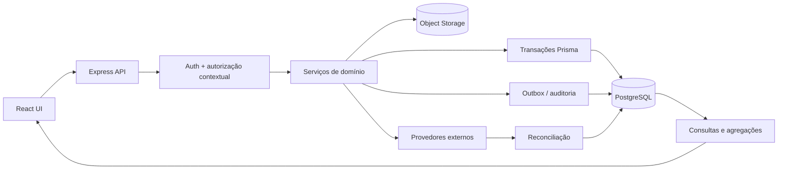

# Plano de ação de governança e integração de dados

## Objetivo

Garantir que toda informação apresentada no GCV tenha uma fonte de verdade identificável, isolamento por conta e condomínio, integridade transacional, histórico de alteração e reconciliação entre processos operacionais, financeiros, documentais e analíticos.

## Princípios obrigatórios

1. PostgreSQL é a fonte de verdade dos dados estruturados.
2. Object storage é a fonte de verdade dos arquivos; PostgreSQL mantém metadados, versões, hash e ACL.
3. `localStorage` pode guardar apenas preferências de interface, nunca registros de negócio ou credenciais.
4. Toda entidade de negócio pertence explicitamente a uma conta ou condomínio.
5. Toda mutação relevante registra ator, instante, entidade, identificador e alteração realizada.
6. Operações compostas são atômicas ou possuem compensação e estado de recuperação explícito.
7. Indicadores e relatórios são calculados a partir dos lançamentos persistidos, com competência e horário de referência visíveis.
8. Integrações externas usam idempotency key, correlação e reconciliação.

## Arquitetura alvo

## Matriz de fonte de verdade

| Domínio | Fonte de verdade | Chave de escopo | Evidência mínima |
|---|---|---|---|
| Identidade e acesso | `User`, `Person`, `Membership`, `OauthAccount` | `accountId`, `condominiumId` | login, convite, papel e revogação |
| Condomínios e edifícios | `Condominium`, `Building` | `accountId`, `condominiumId` | criação e alteração |
| Unidades e ocupação | `Unit`, `UnitRelationship` | edifício e condomínio | início/fim do vínculo e responsável |
| Manutenção | `MaintenanceTicket`, histórico e comentários | `condominiumId`, `unitId` | transições, custos e autores |
| Ativos e planos | `Equipment`, `MaintenancePlan` | `condominiumId` | inspeções, estado e programação |
| Receitas | `BillingPeriod`, `Charge`, itens | `condominiumId`, `unitId` | emissão, liquidação e conciliação |
| Compras | `PurchaseRequest` | `condominiumId` | solicitação, decisão e decisor |
| Contas a pagar | `PaymentOrder` | `condominiumId` | lançamento, aprovação e pagamento |
| Comunicados | `Announcement` | `condominiumId` | publicação, autor e remoção |
| Documentos | `Document`, `DocumentVersion` + storage | `condominiumId`, `unitId` | versão, hash, ACL e acesso |
| Importações | `DataImportJob` + resultados por lote | `condominiumId` | origem, validação, aplicação e rejeições |
| DRE e indicadores | agregações dos lançamentos | competência e condomínio | consulta reproduzível e horário de corte |

## Plano de execução

### Gate 0 — Proteção imediata

- Remover bypass global de `admin`; autorização deve considerar conta e condomínio do recurso.
- Restringir dados pessoais de moradores por perfil e vínculo.
- Eliminar senhas padrão e usar convite/definição de senha ou OAuth.
- Aplicar a visibilidade do chamado também a comentários e anexos.

Aceite: testes negativos comprovam que nenhuma associação em outra conta concede acesso ao recurso solicitado.

### Gate 1 — Fonte única de verdade

- Persistir compras, contas a pagar e comunicados.
- Remover gravações de negócio em `localStorage` e listas estáticas.
- Fazer a criação de condomínio no frontend usar a API existente.
- Substituir staff estático por pessoas e memberships persistidos.

Aceite: dois navegadores autenticados observam os mesmos registros e alterações após atualização da página.

### Gate 2 — Integridade transacional

- Consolidar criação de unidade, proprietário e vínculos em uma operação atômica.
- Tornar criação de documento e versão atômica.
- Aplicar lotes de importação em transação, com exclusão mútua e resultado por linha.
- Adicionar unicidade para edifício, unidade, competência, cobrança e vínculos ativos.
- Adicionar controle otimista por `updatedAt` ou versão nas edições concorrentes.

Aceite: falha induzida no último passo não deixa registros intermediários; reenvio não duplica dados.

### Gate 3 — Financeiro confiável

- Migrar valores monetários de `Float` para `Decimal`.
- Separar cobrança interna de boleto/Pix emitido por provedor.
- Introduzir identificador externo, status de conciliação e idempotency key.
- Derivar DRE de receitas e despesas persistidas por competência.
- Registrar fechamento de competência e impedir mutação sem reabertura auditada.

Aceite: totais do DRE reconciliam com lançamentos e permanecem reproduzíveis após fechamento.

### Gate 4 — Auditoria e observabilidade

- Padronizar auditoria de CRUD com ator, escopo, request ID, antes/depois e motivo.
- Evitar que um log operacional seja gravado como evento técnico indistinguível de auditoria.
- Criar correlação entre importação, documento, cobrança e integração externa.
- Definir retenção, mascaramento de PII e exportação para investigação.

Aceite: cada alteração crítica pode ser reconstruída sem consultar logs efêmeros do container.

### Gate 5 — Documentos e integrações

- Adotar object storage persistente com hash, tamanho, MIME, antivírus e URL assinada.
- Remover respostas de documento simulado em produção.
- Versionar arquivos e impedir alteração silenciosa do conteúdo.
- Processar grandes importações por fila, checkpoints e dead-letter queue.

Aceite: metadado sem arquivo retorna estado explícito; arquivo modificado fora do sistema é detectado pelo hash.

### Gate 6 — Homologação e liberação

- Testes de contrato para todas as APIs e regras de escopo.
- E2E multiusuário e multitenant em `staging`.
- Reconciliação por contagem, totais e amostragem antes/depois da migração.
- Backup e restore drill antes de produção.
- Monitoramento pós-deploy de erros, divergências e filas.

Aceite: checklist go/no-go aprovado, rollback testado e nenhuma divergência crítica aberta.

## Estratégia de migração

1. Inventariar chaves atualmente presentes no navegador e exportar apenas registros necessários.
2. Criar os modelos e APIs persistentes sem remover a leitura anterior.
3. Executar migração única para PostgreSQL com identificador e relatório de reconciliação.
4. Alterar o frontend para leitura da API.
5. Desabilitar a escrita local e remover fallback após uma versão estável.
6. Invalidar dados antigos do navegador sem apagar preferências não relacionadas.

## Indicadores de conclusão

- 100% das telas de negócio com API e modelo persistente identificados.
- 0 registros de negócio gravados em `localStorage`.
- 100% das mutações críticas auditadas.
- 100% dos endpoints protegidos por testes de isolamento positivo e negativo.
- 0 senhas padrão e 0 tokens de integração armazenados no navegador.
- DRE reconciliado com diferença zero para competências fechadas.
- Importações reexecutáveis sem duplicidade e sem estado parcial.
