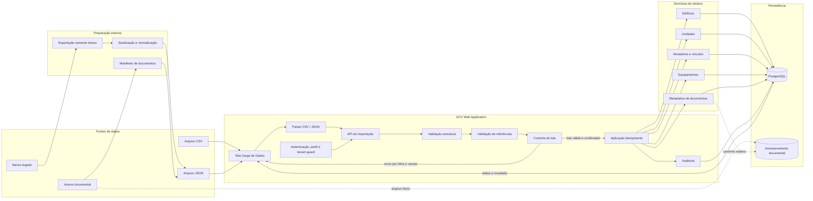
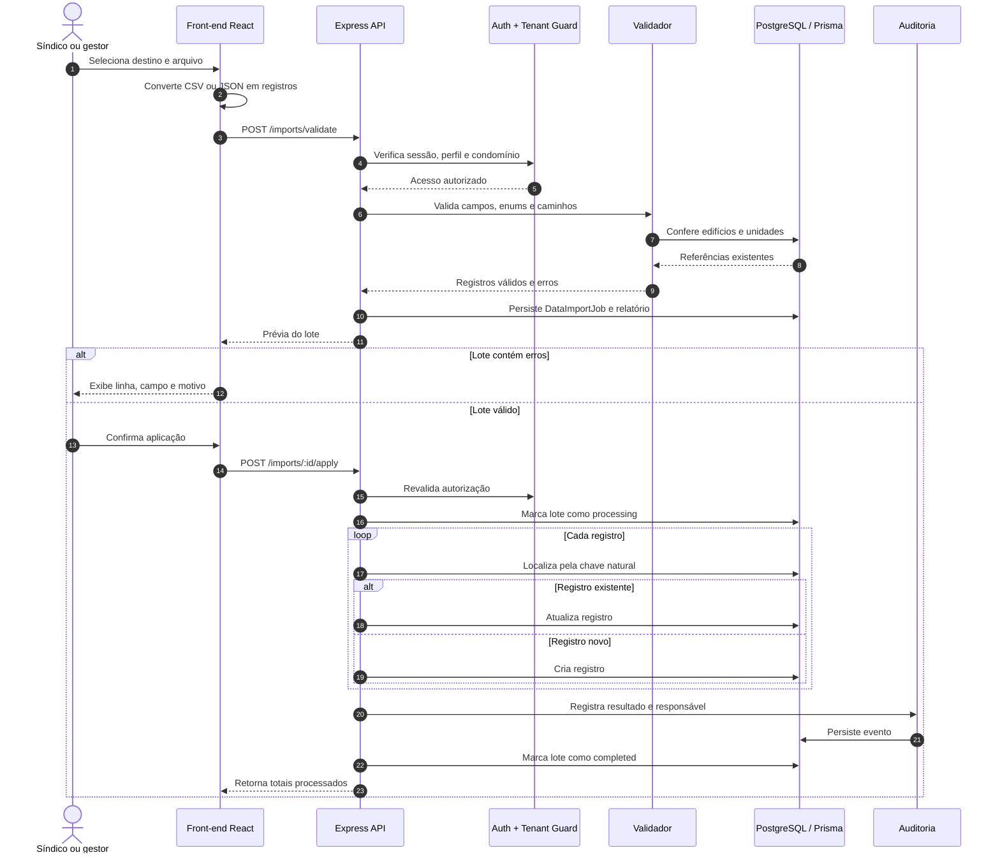
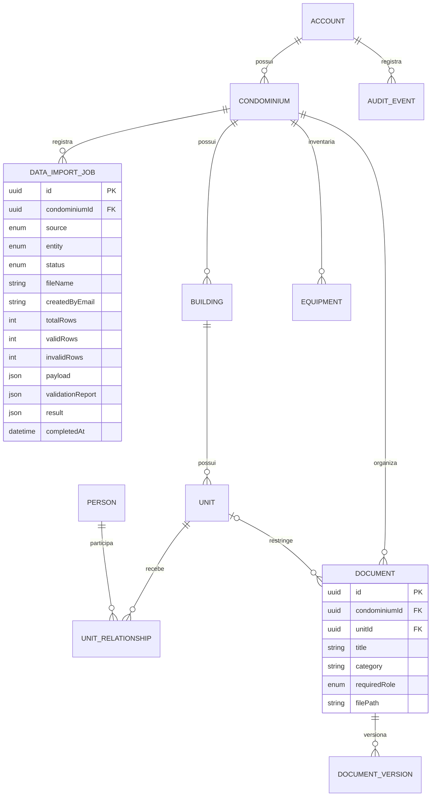
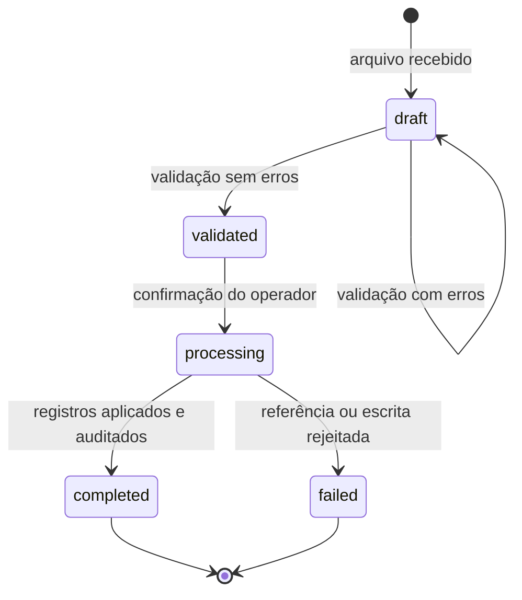
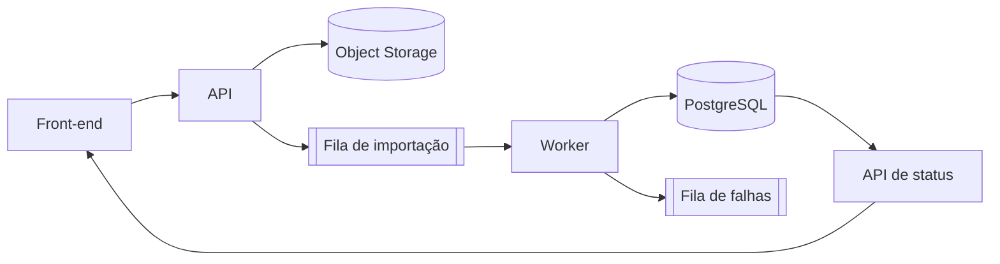

# Arquitetura técnica da carga de dados

## Visão da solução

## Sequência de processamento

## Modelo de dados

## Estados do lote

## Controles técnicos

| Camada | Controle |
|---|---|
| Autenticação | Sessão assinada obrigatória |
| Autorização | Perfis `admin`, `syndic` ou `manager` |
| Isolamento | `tenantGuard` valida acesso ao condomínio |
| Entrada | Contrato Zod e limite de 1.000 registros |
| Integridade | Validação de tipos, enums, datas e referências |
| Idempotência | Chaves naturais por domínio reduzem duplicidades |
| Documentos | Caminhos relativos; caminhos absolutos e `..` são rejeitados |
| Rastreabilidade | Lote, responsável, resultado e evento de auditoria persistidos |
| Banco legado | Exportação somente leitura e sanitização fora da aplicação |
| Produção | Homologação em `dev` e `staging`, backup e aplicação do lote aprovado |

## Evolução prevista

Para volumes superiores ao limite do beta, o processamento deve migrar para uma fila assíncrona. O arquivo original passa a ser armazenado em object storage, o worker processa blocos com checkpoints e a interface acompanha progresso, rejeições e reconciliação sem manter uma requisição HTTP aberta.

