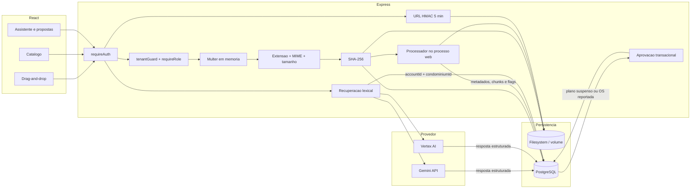
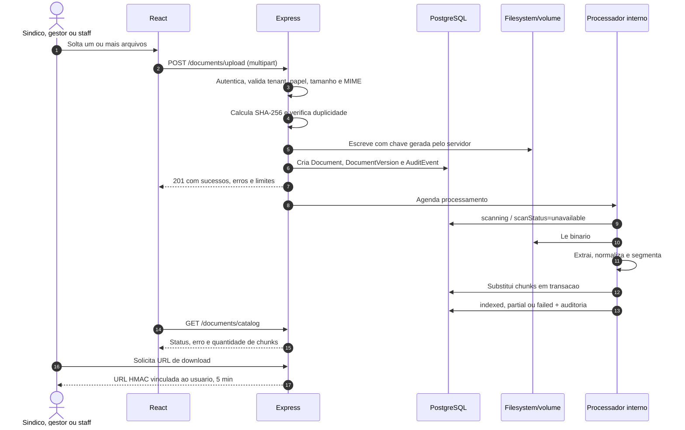
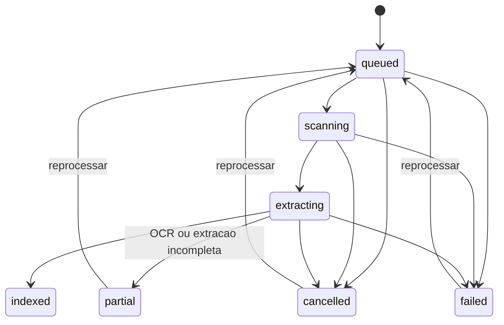
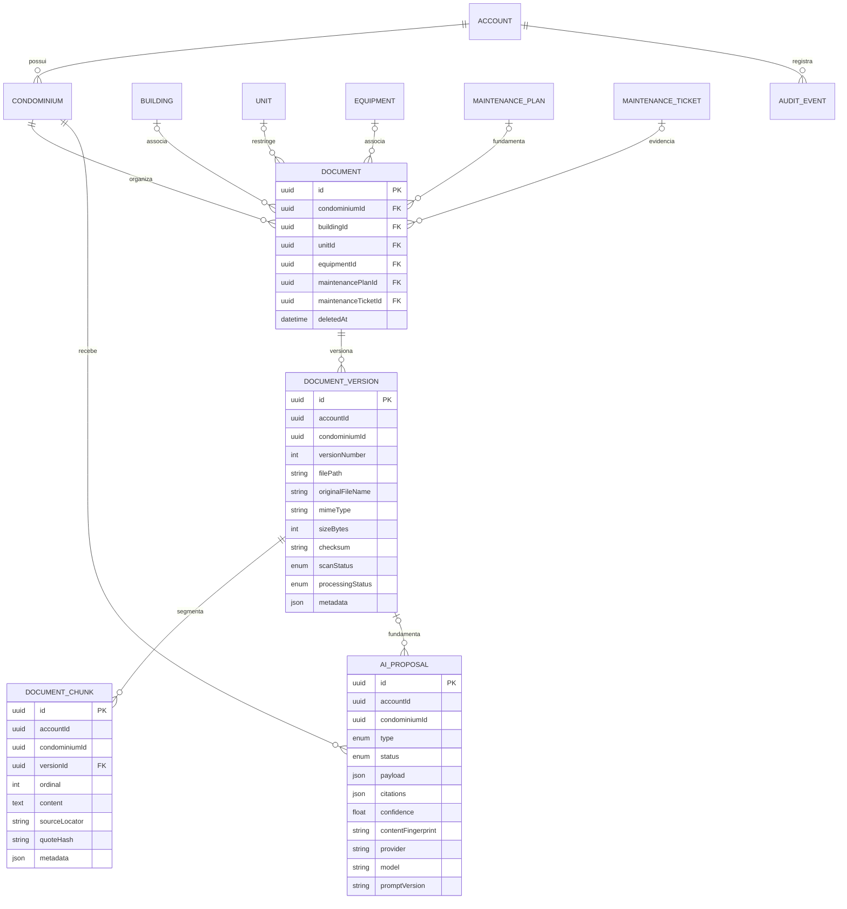
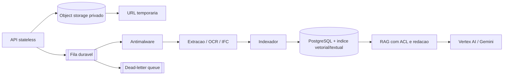

# Arquitetura tecnica de importacao, documentos e IA

Status: implementacao local em validacao. Nao publicada em QA ou producao.

Migrations documentais vigentes: `20260821000000_document_ingestion_and_ai_proposals` e `20260821010000_document_associations`.

## 1. Escopo e estado real

O GCV possui duas trilhas complementares:

1. **Importacao estruturada**: CSV/JSON sao validados e aplicados aos dominios operacionais suportados por meio de `DataImportJob`. Manifestos documentais baseados em caminhos foram descontinuados; documentos entram somente pelo upload autenticado.
2. **Ingestao documental**: arquivos sao enviados ao backend, armazenados fora do PostgreSQL, extraidos, segmentados em trechos e recuperados pelo Assistente de IA com escopo de tenant.

| Capacidade | Estado atual |
|---|---|
| Drag-and-drop e selecao multipla | Implementado no frontend |
| Progresso, cancelamento e repeticao | Implementado; progresso cobre transferencia HTTP, nao cada etapa interna |
| PDF, DOCX, XLSX, CSV, JSON e TXT | Extracao implementada |
| PNG, JPEG, WebP e TIFF | Upload implementado; conteudo fica `partial` sem OCR |
| DWG e IFC | Nao suportados |
| Checksum e duplicidade | SHA-256, unico por condominio |
| MIME real | Assinaturas binaria/textual basicas; nao substitui scanner especializado |
| Antimalware | Integracao ainda nao implementada; status atual `unavailable` |
| Catalogo e correcao de metadados | APIs implementadas; catalogo e reprocessamento no frontend |
| Associacoes operacionais | Documento pode referenciar edificio, unidade, equipamento, plano ou ordem do mesmo condominio |
| Versionamento | Upload inicial e novas versoes por `POST /documents/:docId/versions` |
| RAG | Recuperacao lexical em `DocumentChunk`, filtrada por conta e condominio |
| Citacoes | Documento, versao, trecho, localizador e hash da evidencia |
| Gemini API / Vertex AI | Adaptador implementado por configuracao de ambiente |
| Propostas de plano e OS | Rascunho, revisao e aprovacao humana implementados |
| Download temporario | URL HMAC da aplicacao, vinculada ao usuario e versao, valida por cinco minutos |
| Object storage | Nao implementado; binarios usam filesystem/volume persistente |
| Exclusao auditavel | `DELETE` faz soft delete e auditoria; expurgo fisico por retencao ainda nao existe |
| Legado por caminho | `POST /documents` responde `410` e nao registra arquivos |
| Manifesto documental | Descontinuado e nao aplicavel; a validacao atual ainda responde `201` com lote `draft` invalido, nao `410` |

## 2. Achados por severidade

### Critico

- **Persistencia no Railway depende de volume**: o Docker Compose ja monta `document_storage:/app/uploads`; cada servico Railway ainda precisa de volume persistente equivalente em `DOCUMENT_STORAGE_PATH`.
- **Antimalware indisponivel**: o pipeline marca `scanStatus=unavailable` e continua a extracao. Arquivos reais nao devem ser tratados como livres de malware.

### Alto

- Imagens tecnicas e PDFs sem texto usam `DOCUMENT_OCR_URL` quando configurado; sem o servico ficam `partial` e nao alimentam o RAG.
- O filesystem/volume nao oferece redundancia de object storage, versionamento de objeto ou ciclo de vida gerenciado. A URL temporaria e assinada pela aplicacao, nao pelo storage.
- O processamento usa fila concorrente em memoria e retoma estados pendentes no startup. Um restart recupera metadados persistidos, mas ainda nao substitui uma fila externa duravel para escala horizontal.
- Nao ha rotina de retencao, expurgo do binario e cascata auditavel para chunks e propostas.
- Prompt injection gera flags, mas nao bloqueia chunks suspeitos; a protecao principal permanece na instrucao de sistema.

### Medio

- A recuperacao lexical le ate 1.500 chunks e pontua termos em memoria; nao ha busca vetorial ou indice textual dedicado.
- A validacao MIME usa magic bytes e heuristica UTF-8. Arquivos OOXML nao sao inspecionados profundamente.
- Upload usa memoria do processo, limitado por padrao a oito arquivos de 20 MiB por requisicao.
- O soft delete preserva binarios e chunks ate existir rotina de expurgo; isso e intencional para retencao, mas requer prazo e job operacional.
- A auditoria cobre upload, nova versao, alteracao de metadados, download, processamento, consulta, revisao, rejeicao, aplicacao e soft delete; cancelamento e reprocessamento ainda devem ser uniformizados.
- **Superuser global governado**: o acesso global de `system_admin` e requisito explicito do produto. O risco e de privilegio elevado e deve ser controlado por contas nominativas, MFA no provedor, minimo de administradores, trilha, alertas e revisao periodica; nao e bug nem bloqueador isolado.
- O contrato HTTP do manifesto documental ainda diverge do legado por caminho: ele e bloqueado funcionalmente, mas nao retorna `410` na validacao.

### Baixo

- PDF possui localizador por pagina e XLSX por planilha; DOCX, CSV, JSON e TXT possuem localizadores menos granulares.
- Checksum impede duplicidade exata, nao documentos semanticamente equivalentes.

## 3. Arquitetura implementada


```mermaid
flowchart LR
    subgraph Client[React]
        DROP[Drag-and-drop]
        CATALOG[Catalogo]
        CHAT[Assistente e propostas]
    end
    subgraph API[Express]
        AUTH[requireAuth]
        TENANT[tenantGuard + requireRole]
        UPLOAD[Multer em memoria]
        INSPECT[Extensao + MIME + tamanho]
        HASH[SHA-256]
        SIGN[URL HMAC 5 min]
        PROCESS[Processador no processo web]
        RETRIEVE[Recuperacao lexical]
        APPROVE[Aprovacao transacional]
    end
    subgraph Storage[Persistencia]
        FS[(Filesystem / volume)]
        PG[(PostgreSQL)]
    end
    subgraph AI[Provedor]
        GEMINI[Gemini API]
        VERTEX[Vertex AI]
    end
    DROP --> AUTH --> TENANT --> UPLOAD --> INSPECT --> HASH
    HASH --> FS
    HASH --> PG
    HASH --> PROCESS
    PROCESS --> FS
    PROCESS -->|metadados, chunks e flags| PG
    CATALOG --> AUTH
    AUTH --> SIGN --> FS
    CHAT --> AUTH --> RETRIEVE
    RETRIEVE -->|accountId + condominiumId| PG
    RETRIEVE --> GEMINI
    RETRIEVE --> VERTEX
    GEMINI -->|resposta estruturada| PG
    VERTEX -->|resposta estruturada| PG
    PG --> APPROVE -->|plano suspenso ou OS reportada| PG
```

### Chave fisica

O servidor gera nomes internos aleatorios; o cliente nao informa caminhos:

```text
accounts/<accountId>/condominiums/<condominiumId>/documents/<documentId>/versions/<versionId>/<uuid>.<ext>
```

Chaves absolutas, segmentos `..` e chaves fora da raiz configurada sao rejeitados. A escrita usa arquivo temporario com permissao `0600` e renomeacao atomica.

Em Docker Compose, o named volume `document_storage` e montado em `/app/uploads`, que tambem e o valor de `DOCUMENT_STORAGE_PATH`. No Railway, a mesma durabilidade depende de um volume anexado ao servico da aplicacao.

## 4. Fluxo documental


```mermaid
sequenceDiagram
    autonumber
    actor Operator as Sindico, gestor ou staff
    participant UI as React
    participant API as Express
    participant DB as PostgreSQL
    participant FS as Filesystem/volume
    participant Worker as Processador interno
    Operator->>UI: Solta um ou mais arquivos
    UI->>API: POST /documents/upload (multipart)
    API->>API: Autentica, valida tenant, papel, tamanho e MIME
    API->>API: Calcula SHA-256 e verifica duplicidade
    API->>FS: Escreve com chave gerada pelo servidor
    API->>DB: Cria Document, DocumentVersion e AuditEvent
    API-->>UI: 201 com sucessos, erros e limites
    API->>Worker: Agenda processamento
    Worker->>DB: scanning / scanStatus=unavailable
    Worker->>FS: Le binario
    Worker->>Worker: Extrai, normaliza e segmenta
    Worker->>DB: Substitui chunks em transacao
    Worker->>DB: indexed, partial ou failed + auditoria
    UI->>API: GET /documents/catalog
    API-->>UI: Status, erro e quantidade de chunks
    Operator->>API: Solicita URL de download
    API-->>Operator: URL HMAC vinculada ao usuario, 5 min
```

Uma nova versao percorre o mesmo ciclo de validacao, checksum, armazenamento, processamento e auditoria por `POST /documents/:docId/versions`. O numero e incrementado e downloads apontam somente para a versao mais recente.


```mermaid
stateDiagram-v2
    [*] --> queued
    queued --> scanning
    scanning --> extracting
    extracting --> indexed
    extracting --> partial: OCR ou extracao incompleta
    queued --> cancelled
    scanning --> cancelled
    extracting --> cancelled
    queued --> failed
    scanning --> failed
    extracting --> failed
    partial --> queued: reprocessar
    failed --> queued: reprocessar
    cancelled --> queued: reprocessar
```

## 5. Modelo de dados


```mermaid
erDiagram
    ACCOUNT ||--o{ CONDOMINIUM : possui
    CONDOMINIUM ||--o{ DOCUMENT : organiza
    BUILDING o|--o{ DOCUMENT : associa
    UNIT o|--o{ DOCUMENT : restringe
    EQUIPMENT o|--o{ DOCUMENT : associa
    MAINTENANCE_PLAN o|--o{ DOCUMENT : fundamenta
    MAINTENANCE_TICKET o|--o{ DOCUMENT : evidencia
    DOCUMENT ||--o{ DOCUMENT_VERSION : versiona
    DOCUMENT_VERSION ||--o{ DOCUMENT_CHUNK : segmenta
    DOCUMENT_VERSION o|--o{ AI_PROPOSAL : fundamenta
    CONDOMINIUM ||--o{ AI_PROPOSAL : recebe
    ACCOUNT ||--o{ AUDIT_EVENT : registra

    DOCUMENT {
        uuid id PK
        uuid condominiumId FK
        uuid buildingId FK
        uuid unitId FK
        uuid equipmentId FK
        uuid maintenancePlanId FK
        uuid maintenanceTicketId FK
        datetime deletedAt
    }
    DOCUMENT_VERSION {
        uuid id PK
        uuid accountId
        uuid condominiumId
        int versionNumber
        string filePath
        string originalFileName
        string mimeType
        int sizeBytes
        string checksum
        enum scanStatus
        enum processingStatus
        json metadata
    }
    DOCUMENT_CHUNK {
        uuid id PK
        uuid accountId
        uuid condominiumId
        uuid versionId FK
        int ordinal
        text content
        string sourceLocator
        string quoteHash
        json metadata
    }
    AI_PROPOSAL {
        uuid id PK
        uuid accountId
        uuid condominiumId
        enum type
        enum status
        json payload
        json citations
        float confidence
        string contentFingerprint
        string provider
        string model
        string promptVersion
    }
```

## 6. RAG e geracao assistida

1. A consulta chega com `condoId` na rota.
2. O backend deriva `accountId` e aplica membership ativa e papel.
3. A recuperacao usa o mesmo `accountId` e `condominiumId` e ignora documentos com `deletedAt`.
4. Termos normalizados pontuam ate 1.500 chunks; no maximo oito fontes seguem para resposta e dez para proposta.
5. O modelo recebe resumo operacional e evidencias marcadas como nao confiaveis.
6. A resposta devolve documento, versao, localizador e trecho.
7. Propostas sao validadas com Zod, citadas e persistidas como `draft`.
8. Sindico ou gestor pode aprovar; o superuser global tambem passa por requisito de produto. A transacao cria plano `suspended` ou OS `reported`.
9. Fingerprint e verificacoes de equipamento/unidade reduzem duplicidade e cruzamento de tenant.

O RAG nao substitui validacao tecnica. Normas, periodicidades, riscos e procedimentos devem ser revisados por profissional habilitado quando aplicavel.

## 7. Controles e limites LGPD

| Controle | Implementacao atual | Gate pendente |
|---|---|---|
| Minimizacao | Somente chunks recuperados seguem ao modelo | Categorias proibidas e redacao de PII |
| Isolamento | Filtros por conta/condominio no backend | Suite negativa abrangente |
| Credenciais | Variaveis de ambiente | Rotacao e inventario de secrets |
| Prompt injection | Fonte nao confiavel, flags e instrucao | Quarentena e avaliacao adversarial |
| Malware | Interface HTTP opcional; bloqueia `infected` e falha fechada quando scanner configurado fica indisponivel | Configurar e validar scanner antes de dados reais |
| Exclusao | `DELETE` marca `deletedAt`, audita e bloqueia listagem/download/RAG | Prazo e expurgo fisico de binarios e derivados |
| Download | URL HMAC por usuario/versao, sessao e ACL, validade de 5 min | Migrar assinatura ao object storage quando adotado |
| Superuser | Acesso global e requisito explicito | Contas nominativas, MFA, alertas e revisao periodica |
| Auditoria | Eventos de upload, versao, metadados, download, processamento, revisao/rejeicao/aplicacao de IA e exclusao | Padronizar cancelamento e retry |
| Transferencia internacional | Depende do provedor/regiao | DPA, base legal, regiao e retencao |

Papeis LGPD devem ser confirmados juridicamente. Como referencia operacional, o condominio tende a atuar como controlador e o GCV como operador; isso nao substitui parecer juridico.

## 8. Gates de promocao

| Gate | Criterio de aceite |
|---|---|
| G0 - Local | Migrations `20260821000000` e `20260821010000`, lint, build e testes passam |
| G1 - Persistencia QA | Compose validado e volume Railway comprovado apos redeploy; backup inclui DB e binarios |
| G2 - Seguranca QA | Isolamento, papeis, limites, duplicidade e prompt injection testados |
| G3 - Documentos QA | Associacoes, nova versao, URL de 5 min, soft delete e legado por caminho `410` validados; manifesto alinhado ao contrato decidido |
| G4 - IA QA | Provedor configurado, citacoes verificadas e aprovacao sempre humana |
| G5 - Operacao QA | Reprocessamento, falha, rollback e restore exercitados |
| G6 - LGPD | Retencao, DPA, regiao, base legal e controles do superuser documentados |
| G7 - Producao | Antimalware ou risco formalmente aceito, storage/restore evidenciado e autorizacao explicita |

## 9. Arquitetura alvo


```mermaid
flowchart LR
    API[API stateless] --> OBJ[(Object storage privado)]
    API --> QUEUE[[Fila duravel]]
    QUEUE --> AV[Antimalware]
    AV --> OCR[Extracao / OCR / IFC]
    OCR --> INDEX[Indexador]
    INDEX --> DB[(PostgreSQL + indice vetorial/textual)]
    DB --> RAG[RAG com ACL e redacao]
    RAG --> MODEL[Vertex AI / Gemini]
    OBJ --> SIGNED[URL temporaria]
    QUEUE --> DLQ[[Dead-letter queue]]
```

Esta evolucao remove dependencia do container e separa arquivos infectados antes da extracao. Ate la, a solucao atual deve ser tratada como beta controlado.
