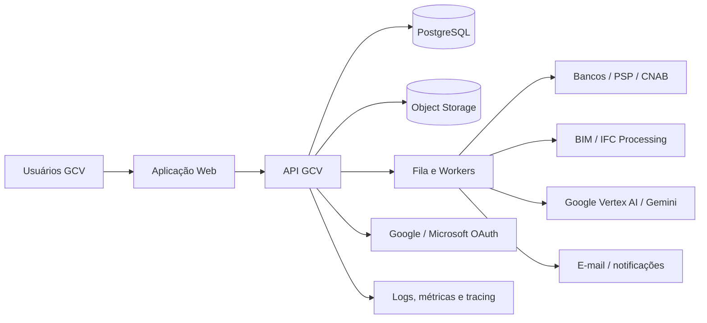
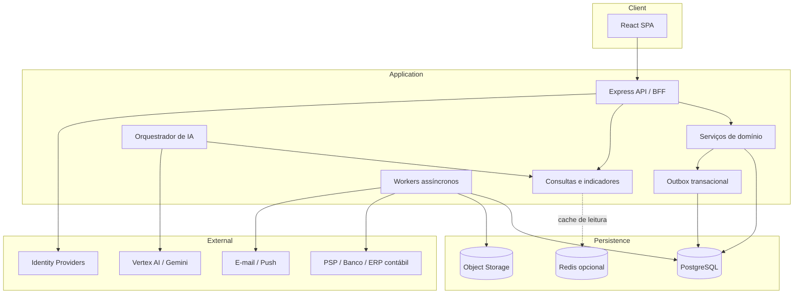
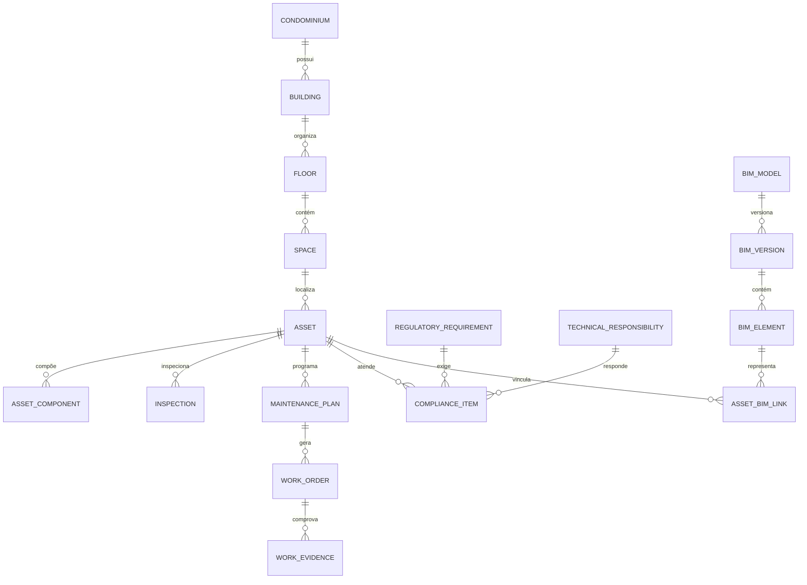
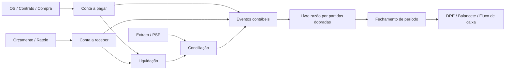
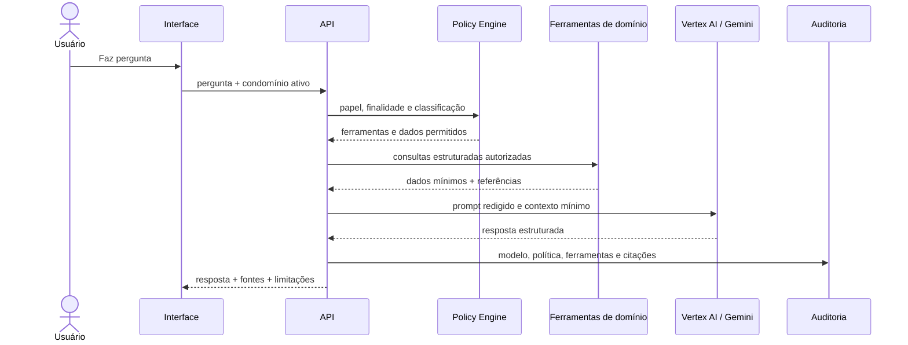

# Arquitetura-alvo do produto GCV

Data: 2026-07-11

Status: referência canônica para evolução pós-beta

Escopo: arquitetura integrada de gestão condominial, operação predial, engenharia, BIM, custo do ciclo de vida, documentos, finanças, contabilidade e IA.

Este documento define arquitetura de software e produto. Regras contábeis, fiscais, jurídicas, de engenharia e proteção de dados devem ser validadas por profissionais habilitados antes do uso oficial.

## 1. Objetivo e posicionamento

O GCV será um sistema de registro e decisão para condomínios, síndicos profissionais e administradoras de pequeno e médio porte. A solução deve conectar o cadastro físico do empreendimento aos eventos operacionais, documentos, obrigações técnicas e fatos financeiros sem transformar estimativas, modelos de IA ou simulações em registros oficiais.

Públicos principais:

- síndico e administradora: governança, aprovações, prestação de contas e risco;
- gestor predial e zelador: ativos, inspeções, planos, ordens e evidências;
- engenharia e fornecedores: inventário técnico, documentos, responsabilidades e execução;
- financeiro e contador: orçamento, contas, competência, conciliação e demonstrativos;
- conselho: fiscalização, aprovações e leitura de evidências;
- moradores: cobranças, documentos, comunicados e chamados dentro do próprio escopo;
- auditor e suporte: rastreabilidade sem alteração indevida dos dados.

## 2. Princípios obrigatórios

1. PostgreSQL é a fonte de verdade dos registros estruturados.
2. Object storage é a fonte de verdade dos arquivos; o banco guarda metadados, hash e ACL.
3. Toda entidade de negócio possui `accountId` e/ou `condominiumId` verificável no servidor.
4. Valores monetários usam `Decimal`; datas financeiras distinguem emissão, vencimento, liquidação e competência.
5. Eventos técnicos, financeiros e contábeis são relacionados, mas não confundidos.
6. BIM é uma representação versionada do ativo físico, não a origem de valores contábeis.
7. LCC é uma projeção versionada com premissas explícitas, nunca um lançamento realizado.
8. IA consulta ferramentas autorizadas e produz recomendações citáveis; não altera registros críticos sem confirmação humana.
9. Toda mutação crítica registra ator, origem, motivo, antes/depois e correlação.
10. Integrações são idempotentes, observáveis e reconciliáveis.
11. Relatórios fechados são reproduzíveis pelo mesmo conjunto de lançamentos e versão de regra.
12. Segurança, acessibilidade e LGPD são requisitos de domínio, não acabamentos posteriores.

## 3. Visão de contexto

O beta pode continuar como um serviço modular único em Railway. As fronteiras abaixo devem existir no código antes de qualquer separação em microsserviços. Separar processos só será justificável por escala, segurança, disponibilidade ou carga assíncrona.

## 4. Arquitetura de contêineres

Componentes de implantação:

- `web-api`: frontend estático e API síncrona;
- `worker`: importações, documentos, notificações, reconciliação, BIM e tarefas de IA;
- `postgres`: banco isolado por ambiente;
- `object-storage`: arquivos, modelos IFC, relatórios e anexos;
- `redis` opcional: filas e cache, somente quando a carga justificar;
- observabilidade: logs estruturados, métricas, tracing e alertas.

## 5. Contextos de domínio

| Contexto | Responsabilidade | Registros principais |
|---|---|---|
| Identidade e tenancy | usuários, convites, papéis, escopo e sessão | User, Person, Membership, OAuthAccount |
| Portfólio predial | condomínios, edifícios, pavimentos, espaços e unidades | Account, Condominium, Building, Floor, Space, Unit |
| Pessoas e ocupação | proprietário, locatário, dependente e histórico | Person, UnitRelationship, ConsentRecord |
| Ativos e manutenção | ativos, componentes, inspeções, planos, OS e falhas | Asset, AssetComponent, Inspection, MaintenancePlan, WorkOrder |
| Compliance técnico | obrigação, certificado, responsável e evidência | RegulatoryRequirement, Certificate, TechnicalResponsibility |
| BIM e digital twin | modelos, versões, elementos e vínculos com ativos | BimModel, BimVersion, BimElement, AssetBimLink |
| Documentos | upload, versões, classificação, retenção e acesso | Document, DocumentVersion, DocumentAccess |
| Compras e contratos | solicitação, cotação, aprovação, contrato e fornecedor | Supplier, PurchaseRequest, Quote, Contract |
| Financeiro operacional | cobranças, contas a pagar, recebimentos e pagamentos | Receivable, Payable, Settlement, BankTransaction |
| Contabilidade | plano de contas, partidas, períodos e fechamentos | LedgerAccount, JournalEntry, JournalLine, AccountingPeriod |
| Orçamento e rateio | orçamento, centro de custo, frações e rateios | Budget, CostCenter, AllocationRule, Assessment |
| LCC | cenário, premissas, fluxo projetado e resultado | LccScenario, Assumption, ProjectedCashFlow |
| Comunicação | comunicados, audiência, entrega e leitura | Announcement, NotificationDelivery |
| Importação e integração | lotes, mapeamento, conectores e reconciliação | ImportJob, IntegrationConnection, ReconciliationRun |
| Auditoria e governança | eventos imutáveis, aprovações e investigação | AuditEvent, Approval, OutboxEvent |
| IA e conhecimento | políticas, conversas, ferramentas e citações | AiPolicy, AiConversation, AiRun, AiCitation |

Cada contexto deve expor comandos, consultas e eventos; componentes React não acessam Prisma nem montam regras financeiras ou técnicas.

## 6. Modelo integrado de engenharia, BIM e manutenção

Requisitos mínimos:

- hierarquia física independente de textos livres em `location`;
- código patrimonial e classificação do ativo;
- fabricante, modelo, série, instalação, garantia e vida útil;
- criticidade, condição, risco, falha e indisponibilidade;
- checklist e medição por inspeção;
- evidência com arquivo, autor, data e hash;
- periodicidade regulatória e operacional separadas;
- geração automática de OS pelo plano;
- vínculo de custo real da OS ao financeiro;
- vínculo IFC por `GlobalId`, sem inferência pelo nome.

Formatos BIM iniciais: IFC como fonte interoperável, glTF para visualização web e BCF para issues. O processamento ocorre em worker; o navegador recebe geometria otimizada e metadados autorizados.

## 7. Arquitetura LCC

O LCC deve operar como motor determinístico e versionado.

Entradas:

- ativos e componentes;
- valor de aquisição/substituição;
- vida útil e curva de degradação;
- planos e custos históricos;
- inflação, desconto e horizonte;
- cenários de manutenção, energia e indisponibilidade;
- origem, data e confiança de cada premissa.

Saídas:

- valor presente líquido;
- custo anual equivalente;
- custo acumulado por categoria;
- substituições previstas;
- análise de sensibilidade;
- diferenças entre cenário base, preventivo e reativo.

Cada execução persiste `scenarioVersion`, premissas, fórmula, moeda, data-base e resultados. A IA pode explicar resultados, mas não calcular o valor oficial.

## 8. Arquitetura financeira e contábil

Regras estruturais:

- dinheiro sempre em `Decimal(19,4)` ou precisão aprovada;
- plano de contas e centros de custo por conta, com modelo inicial versionado;
- lançamento contábil balanceado: soma de débitos igual à soma de créditos;
- eventos operacionais geram propostas contábeis por regras versionadas;
- fechamento impede alteração; ajuste ocorre por lançamento de estorno/reabertura auditada;
- cobrança não é boleto, liquidação não é conciliação e DRE não é fluxo de caixa;
- competência, caixa e orçamento são visões separadas;
- toda integração bancária usa idempotency key e identificador externo;
- dados bancários e fiscais possuem classificação e acesso restrito.

Primeira entrega deve ser contabilidade gerencial. Escrituração fiscal/oficial, obrigações acessórias e assinatura do contador exigem validação regulatória específica.

## 9. Arquitetura de IA

Camadas obrigatórias:

- gateway de modelos com Vertex AI/Gemini como primeiro adaptador;
- política por tenant, perfil, finalidade e classificação do dado;
- ferramentas server-side com consultas parametrizadas;
- redaction de PII e minimização de contexto;
- saída estruturada e citações para registros do GCV;
- limite de custo, taxa, tokens e tempo;
- proteção contra prompt injection em documentos;
- avaliação offline com conjunto sintético e testes de vazamento;
- confirmação humana para criar OS, aprovar compra, publicar comunicado ou lançar finanças;
- proibição de lançar contabilidade, aprovar pagamento ou assinar laudo autonomamente.

## 10. Documentos e conhecimento técnico

Fluxo: solicitar URL assinada, enviar arquivo diretamente ao storage, validar MIME/tamanho/hash, escanear malware, extrair metadados em worker e somente então publicar a versão.

Metadados mínimos: categoria, proprietário, escopo, validade, retenção, classificação LGPD, checksum, tamanho, MIME, versão e vínculo com ativo, unidade, contrato ou obrigação.

OCR e embeddings são derivados descartáveis. O arquivo original e seus metadados continuam sendo a evidência oficial.

## 11. Segurança e governança

- RBAC combinado com ABAC por tenant, condomínio, unidade e classificação;
- menor privilégio e separação de funções em aprovação, pagamento e fechamento;
- MFA obrigatório para perfis privilegiados quando suportado pelo provedor;
- sessões revogáveis e rotação de segredos;
- criptografia em trânsito e repouso;
- trilha de auditoria append-only com retenção definida;
- política LGPD para base legal, consentimento, acesso, correção, portabilidade e descarte;
- backups, PITR e restore drill;
- SAST, SCA, secret scan, testes de isolamento e pentest;
- nenhuma credencial de banco, OAuth ou IA no frontend.

## 12. Contratos e padrões técnicos

- API REST `/api/v1`, contratos Zod e OpenAPI gerado;
- erros no padrão Problem Details com `requestId`;
- paginação por cursor para coleções grandes;
- `Idempotency-Key` para comandos externos ou financeiros;
- optimistic locking para edições concorrentes;
- outbox transacional para eventos e integrações;
- timestamps UTC, apresentação no fuso do condomínio;
- frontend com rotas URL, cliente tipado, cache e invalidação por domínio;
- componentes acessíveis e responsivos conforme WCAG 2.2 AA;
- feature flags por ambiente e tenant.

## 13. Ambientes e promoção

| Ambiente | Dados | Objetivo | Promoção |
|---|---|---|---|
| local | sintéticos | desenvolvimento e testes | nenhuma |
| dev | sintéticos | integração contínua | `main` |
| staging | sintéticos/anonimizados | ensaio de release e migração | artefato imutável |
| production | reais após aprovação | beta e operação | tag + aprovação |

O mesmo digest de imagem deve ser promovido entre ambientes. Migração ocorre antes do tráfego, com backup, compatibilidade retroativa e rollback operacional documentado.

## 14. Requisitos não funcionais iniciais

- disponibilidade beta: 99,5%; alvo comercial: 99,9%;
- p95 de leitura API abaixo de 500 ms sem integrações externas;
- RPO beta de 24 h e RTO de 8 h; reduzir conforme clientes e SLA;
- zero acesso cross-tenant nos testes automatizados;
- 100% das mutações financeiras, técnicas e de acesso documental auditadas;
- DRE fechado com diferença de reconciliação igual a zero;
- acessibilidade WCAG 2.2 AA nos fluxos críticos;
- observabilidade por request, job, integração e tenant sem registrar PII desnecessária.

## 15. Decisões arquiteturais a registrar

Criar ADRs antes das respectivas implementações:

- ADR-007: modular monolith e fronteiras de domínio;
- ADR-008: object storage e processamento documental;
- ADR-009: ledger contábil e política de competência;
- ADR-010: IFC/glTF/BCF e digital twin;
- ADR-011: motor LCC e versionamento de premissas;
- ADR-012: Vertex AI/Gemini, residência e retenção de dados;
- ADR-013: outbox, filas e idempotência;
- ADR-014: classificação LGPD e retenção;
- ADR-015: estratégia de deploy e promoção de artefato.

## 16. Responsabilidade multidisciplinar

| Decisão | Engenharia de software | Engenharia civil | Administração | Finanças/contabilidade | Segurança/LGPD |
|---|---|---|---|---|---|
| modelo de ativos | implementa | aprova taxonomia | valida operação | valida custo | valida acesso |
| obrigações técnicas | implementa agenda | aprova regras | define responsáveis | valida orçamento | valida evidência |
| LCC | implementa motor | valida premissas | usa cenários | valida taxas/custos | audita versão |
| contabilidade | implementa ledger | fornece eventos | aprova processos | aprova regras | valida segregação |
| IA | implementa gateway | valida respostas técnicas | define usos | limita aconselhamento | aprova política |
| release | automatiza | executa UAT técnico | aceita operação | reconcilia | autoriza dados reais |

Nenhum gate que dependa de atribuição profissional pode ser concluído apenas por código.
